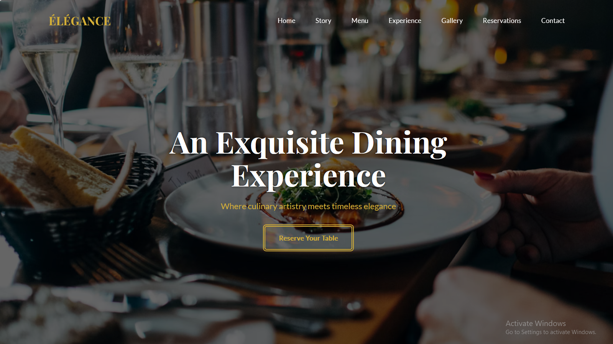

🍽️ ÉLÉGANCE — Luxury Restaurant Website

ÉLÉGANCE is a luxury fine-dining restaurant website designed to deliver an elegant and immersive digital experience.
The website showcases a premium restaurant brand with sophisticated design, smooth navigation, and visually rich sections that highlight menu offerings, ambiance, and reservations.

Built using HTML, CSS, and JavaScript, this project focuses on modern UI/UX design, responsiveness, and high-end presentation, similar to websites of Michelin-star restaurants.

🌐 Live Demo

🔗 View Live Website
https://devbyfahad.github.io/ELEGANCE-Restaurant-Website/

📸 Screenshots
Homepage

Menu Section

Reservation Section

Gallery Section

✨ Features

🍴 Luxury Restaurant UI Design
Elegant layout inspired by high-end restaurant websites.

📱 Fully Responsive
Optimized for desktop, tablet, and mobile devices.

🎨 Premium Visual Aesthetic
Minimalist design with refined typography and modern spacing.

📜 Interactive Menu Section
Showcases dishes with structured categories and clean layout.

🖼 Restaurant Gallery
Displays food photography and restaurant ambiance.

📅 Reservation Section
Allows visitors to simulate booking a table.

⚡ Smooth Navigation
Clean scrolling and intuitive navigation across sections.

💡 Modern Frontend Practices
Semantic HTML, organized CSS, and modular JavaScript.

🛠️ Technologies Used
HTML5
CSS3
JavaScript (ES6)
Responsive Design
Flexbox & Grid Layout
📂 Project Structure
ÉLÉGANCE-Restaurant-Website
│
├── index.html
├── style.css
├── script.js
│
├── images
│   ├── hero.jpg
│   ├── dishes.jpg
│   ├── restaurant.jpg
│
└── README.md
🚀 Installation & Setup

If you want to run this project locally:

# Clone the repository
git clone https://github.com/devbyfahad/ELEGANCE-Restaurant-Website.git

# Open the project folder
cd ELEGANCE-Restaurant-Website

# Run the website
Open index.html in your browser
🎯 Project Purpose

This project was created to:

Practice advanced front-end development
Build a premium portfolio project
Demonstrate UI/UX design for luxury brands
Showcase responsive website development
👨‍💻 Author

Muhammad Fahad

Frontend Developer passionate about building modern, responsive, and visually engaging web applications.

🔗 GitHub:
https://github.com/devbyfahad

⭐ If you like this project, consider starring the repository!
